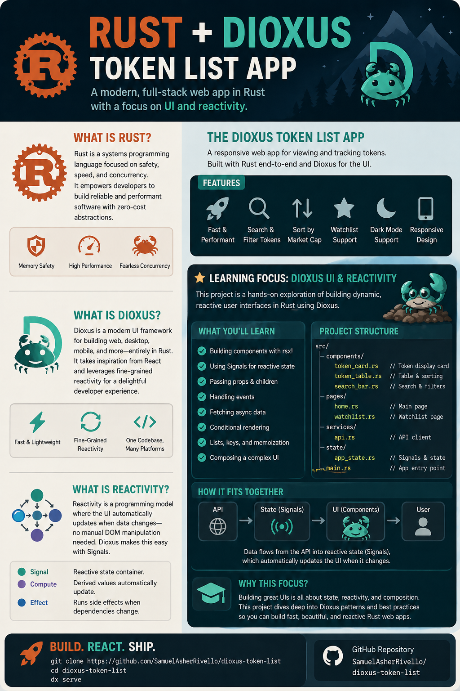

# Dioxus Token List

The app displays top market data from CoinGecko, caches from online data to local DB. Built with Dioxus and Rust, both the front-end and server-side.

 

## Live Web App

https://samuelasherrivello.github.io/dioxus-token-list/

The static web build is exported and hosted automatically with each push to the main branch.

 

## Pics

### Screenshot

### Infographic

 

## Scripts

### Common

| Command | Required? | Description |
| ------- | --------- | --- |
| `.\Scripts\Common\RunWeb.ps1` | ✅ | Starts the web app on `0.0.0.0:8080` for laptop and same Wi-Fi phone testing. Stops an older `dx serve` process on that port first. |
| `.\Scripts\Common\RunDesktop.ps1` | ✅ | Starts the desktop app with Dioxus desktop. |

### Other

| Command | Required? | Description |
| ------- | --------- | --- |
| `.\Scripts\Other\RunTests.ps1` | ❌ | Runs UI crate tests. |

 

## Architecture

| Path | Description |
| ---- | ----------- |
| [`packages/ui`](./packages/ui) | Shared Dioxus routes, components, models, services, CSS, and local token images. |
| [`packages/web`](./packages/web) | Web entrypoint, favicon, web CSS, and browser SQLite WASM/worker files under `public/assets/sqlite.org`. |
| [`packages/desktop`](./packages/desktop) | Desktop entrypoint and desktop CSS. |

The shared UI crate owns the app shell, routes, token list, toast region, developer tools, token loading, storage, online fetches, and platform-specific database service modules.

 

## Codex Workflow

This repo includes Codex-specific context so agent prompts can stay short and consistent.

| File | Purpose |
| ---- | ------- |
| [`AGENTS.md`](./AGENTS.md) | Dioxus 0.7 rules and project workflow instructions for agents. |
| [`.agentignore`](./.agentignore) | Keeps agents away from build output, runtime data, test artifacts, logs, and dependency caches. |
| [`.agents/skills/`](./.agents/skills) | Spec Kit skills for Codex, invoked as `$speckit-constitution`, `$speckit-specify`, `$speckit-plan`, `$speckit-tasks`, and related commands. |
| [`.codex/rules/`](./.codex/rules/frontend-design.md) | Frontend design rule adapted from distinctive frontend skill guidance for this Dioxus token-list app. |
| [`.codex/skills/`](./.codex/skills/dioxus-token-list-project/SKILL.md) | Project-specific skill guidance for Dioxus, cache, and verification work. |
| [`.specify/`](./.specify) | Spec Kit project configuration, constitution, PowerShell workflow scripts, and templates. |
| [`specs/`](./specs) | Feature specifications, starting with the status-quo baseline spec for the existing app. |

 

## Credits

**Created By**

- Samuel Asher Rivello
- Over 25 years XP with game development (2025)
- Over 10 years XP with Unity (2025)

**Contact**

- Twitter - [@srivello](https://twitter.com/srivello)
- Git - [Github.com/SamuelAsherRivello](https://github.com/SamuelAsherRivello)
- Resume & Portfolio - [SamuelAsherRivello.com](https://www.SamuelAsherRivello.com)
- LinkedIn - [Linkedin.com/in/SamuelAsherRivello](https://www.linkedin.com/in/SamuelAsherRivello)

**License**

Provided as-is under [MIT License](./LICENSE) | Copyright (c) 2006 - 2026 Rivello Multimedia Consulting, LLC
